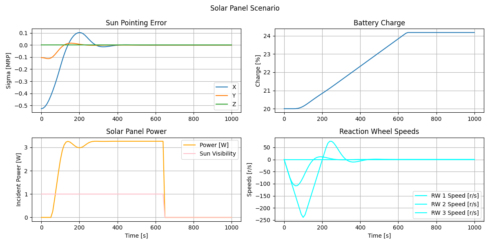

# Zendir Python Examples

This repository includes a number of example scenario files that can be used as the basis for interacting with the Zendir API. Each of the scenarios showcases a particular use-case of the API. In order to use these examples, ensure that `zendir` is installed from Python pip. The `master` branch of this repository will align with the latest version of the `zendir` Python mpodule.

*The sun pointing scenario uses reaction wheels and flight software to orient a spacecraft's solar panel towards the sun, charging the battery when not in the Earth's eclipse.*

---

### API Tokens

The Zendir API requires an active API token for accessing the simulation. API tokens can be obtained from the official Zendir website, at https://zendir.io. Please make sure your token is active and has available credits.

---

### Credential Helper

Many of the example Python scenarios, located in the `scenarios` directory use the `credential_helper.py` script to load in a user's credentials (including their API access token) so run the scenarios. This script creates a `zendir.Client` object, which provides access to the simulation. Before running the scenario files, make sure to fill out the `API_TOKEN` parameter in that file with your correct and valid API token.
